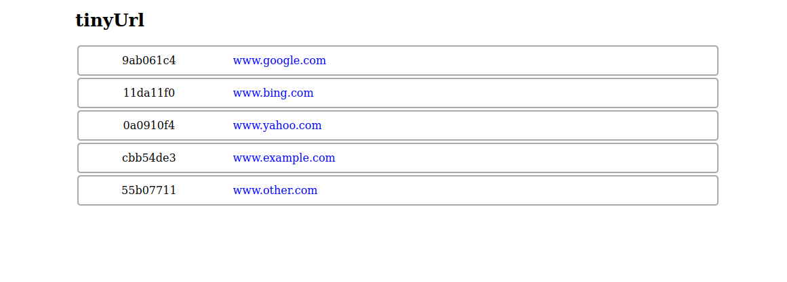

# tinyUrl-frontend

A frontend for our tinyurl servers: [tinyUrl](https://github.com/micarlise/tinyUrl) and [url-shortener](https://github.com/micarlise/url-shortener).



## Running the frontend container

```bash
docker-compose up -d
```

Then visit `localhost:8080/` in your local browser.

*One of the tinyurl servers need to be running at localhost:3000/*